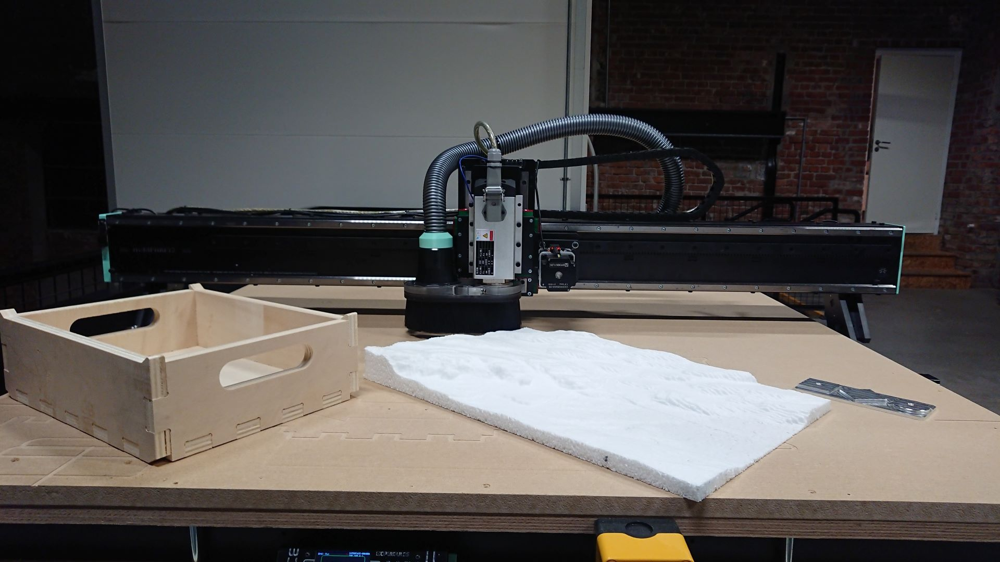
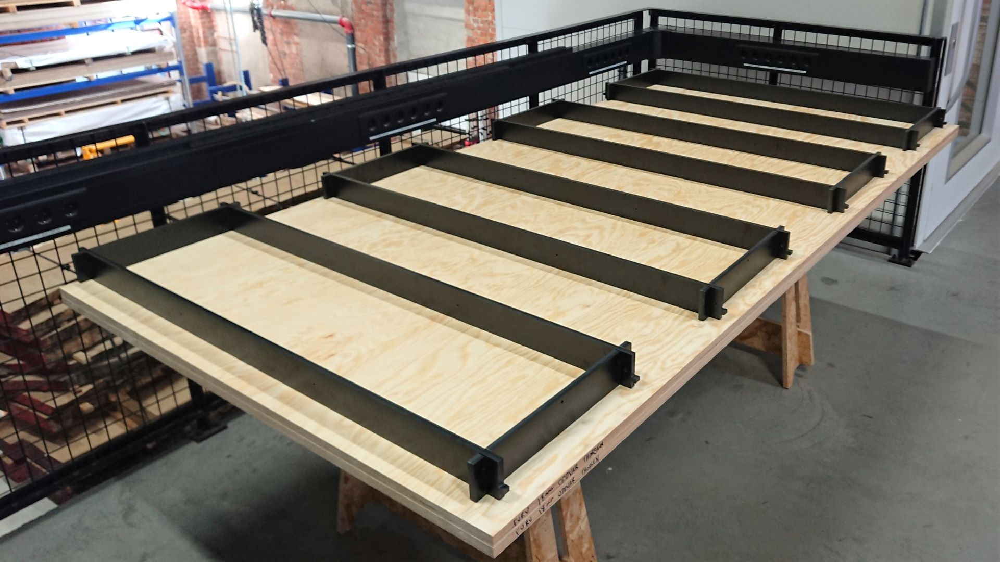
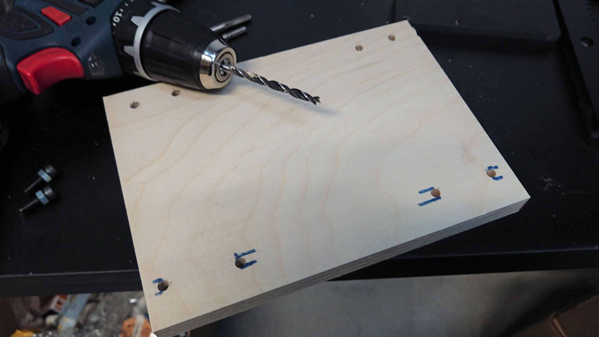

# Humphrey2
A self replicating large format open hardware CNC router

*by Jens Dyvik, March 2022 - ongoing*

### Index

 - [Dev log]()
 - [Bill of materials]()
 - [CAD file of assembly]()
 - [Files for CNC milling]()
 - [Files for 3D printing]()
 - [License]()

### Dev log November 29th 2022 - Good test cuts and promising self-replication

*15mm poplar plywood cut in one pass at 4200mm/m, 50mm styrofoam 3D milled and 8mm aluminium test pattern*

*Accuracy seems to be about +- 0.1mm. 6082 Aluminium cut with a 6mm single flute bit. 0.7mm pass depth, 1440mm/m feedrate + finish pass*

*All phenolic parts for a Humphrey2 fit on one 2440mm x 1220mm x12mm sheet. The same size as the work area.*

*Test milling of parts went well*

*Cutsheet with all the leftover material removed. Note all the screws holding down each part allowing for a finish pass*

### Dev log October 31st 2022 - Smooth sailing for first test milling of parts and assembly

*Very few hickups during first assembly - next up lots of testing*

*Full size phenolic sheet loaded on [Hanzo](https://github.com/Fabricatable-Machines/Hanzo), ready to become Humphrey2 parts*

*It felt great to use [Hanzo](https://github.com/Fabricatable-Machines/Hanzo), a Fabricatable machine, to make another Fabricatable machine!*

*Using leftovers to make X - Z assembly parts*

*The cross pieces were also milled from leftovers*

*Batch milling pinions from POM plastic leftovers*

*The cross pieces ensure constant distance between the left and right X rail, and function as torsion box spacers*

*All holes thread milled during production makes assembly fast*

*Using a spade drill to counterbore the carriage bolt holes*

*The two plywood sheets that make up the top and bottom torsion box skin of the bed can be drilled manually on site. This makes for cheaper and easier shipping of the milled parts.*

*The adjustable feet enable leveling. What kind of sawhorse or legs to use is open.*

*Using masonry thread and three washers to make the outer walls carrying the X rails as straight as possible. As spirit level is used to try to make the assembly flat.*

*The gantry has spacer nuts so shorter screws can be used*

*Again, all holes thread milled during manufacturing makes assembly super fast*

*Gantry feet parts*

*Tightening under pressure*

*Mounting rails and racks*

*Mounting the X-Z carriage*

*Mounting gearboxes to the steppers and pinion and motor plates to the gearboxes*

*Gantry detail. The pinions should be snug but not too tight against the racks.*

*Preparing for electronics work. I am testing the OpenBuilds Blackbox and Interface for fast and easy wiring.*

### Dev log October 4th 2022 - Nesting done + design tweaks

Next up; machining, assembly and testing!

*59 parts to machine from phenolic resin composite, all from a single cutsheet*

*Portrait of a self replicating machine*

*Added probe plate for Z axis probing of bit length*

### Dev log September 9th 2022 - Initial design is done!

Finally the first version of the design is done. The FreeCAD model is fully parametric, which feels great. So it is possible to change parameters like material thickness, tolerances, clearance between the gantry and the bed and so on without breaking the model. Next up is test milling some parts and maybe do some parameter tuning before milling all the parts for the first prototype!

*Proportions feel good*

*The skeleton without the plywood torsion box skins and the sacrificial MDF layer*

*Close up of the gantry and XZ axis*

*Front view*

*Side view*

*Top view*

*A rough nesting test indicates that all the milled parts will fit on one cutsheet as planned!*

### Dev log August 2022 - CAD progress and a FreeCAD bug

The master CAD design is progressing slow and steady. I ran into a bug with FreeCAD expressions *(reported [here](https://forum.freecadweb.org/viewtopic.php?f=3&t=71309&p=620375#p620375))*, so I have reverted to using FreeCAD version 19 for now. It has been nice to use the relatively new FreeCAD Link feature to make a simple assembly by embedding the external rack and pinion file. Saving both computation time and storage space :)

### Dev log June 2022 part2 - Starting the CAD master design file

I have started making the proper design file in Freecad. The work in progress file is published and reguraly updated [here](https://github.com/Fabricatable-Machines/Humphrey2/blob/main/humphrey2.FCStd).

Work in progress phenolic skeleton

I am nesting the parts onto the bed of the machine as I go. The goal is to be able to cut all critical parts from one cutsheet.

Plywood above and below the skeleton makes up the torsion box. The top layer is a MDF plate as a scarafical layer

Test nesting onto the bed of the 3D model.

### Dev log June 2022 - Testing construction principles and components

In order to test design ideas, I decided to make a 1:1 test of a small cutout section of the machine bed

The [Hanzo](https://github.com/Fabricatable-Machines/Hanzo) machine that I developed and built is now operatoinal. It feels great to use one fabricatable machine to make the parts for the next one!

Cutsheet for the phenolic resin cardboard composite test parts.

The plywood edges came out super clean and straight on Hanzo, using a 6mm compression cutter in two passes.

The phenolic pieces screw together with tapped holes.

Testing to use a marker to mark positions for pre drilled holes. I want avoid having to CNC machine the 2440mm x 1220mm plywood sheets.

Drilling the plywood sheets by hand will mitigate the need for shipping plywood sheets with the phenolic machine parts, instead they can be sourced locally.

100mm wood screws will lock the torsion box bed together.

The [CNC friendly](https://github.com/fellesverkstedet/fabricatable-machines/wiki/Modules#cnc-friendly-rack-and-pinion) rack screws into the side wall with quite tight tolerances.

A 15mm linear rail mounts above the rack into tapped holes.

Milling a [CNC friendly](https://github.com/fellesverkstedet/fabricatable-machines/wiki/Modules#cnc-friendly-rack-and-pinion) pinion in POM on [Hanzo](https://github.com/Fabricatable-Machines/Hanzo).

First test assembled. I have mixed feelings about the flexure that ensure constant preload between the pinoin and the rack.

A second test with a more classic adjustable motorplate instead of flexures.

**Notes from making and testing:**

 - Tolerance for milled sides needs to be bigger.
 - Leading chamfer/fillets for slots will help in assembly.
 - Tapping though 12mm material with4 tap diffiult. Note for screw length.
 - Outer wall can be mounted upside down. Hoka poka.
 - 100mm screws are easy to get very skew.
 - A flexure at 60x4mm dimension is much too stiff. 60x2mm seems promising.
 - The flexure vibrates a bit at higher speeds.
 - Not enough space for indents in pinion that show set screw hole drill positions. 3 tabs can do the same job.
 - Cut depth of pinion teeth reduced to 5.6mm because of available 2mm bit flute lengths
 - Inside hole set to 14.05mm. Premilled to ø 13.6, then ran three times at ø14.05mm with a long 5deg ramp continuous to the bottom. Still the bottom of the hole became too small. Maybe reduce thickness of stock?
 - Motorplate with three screws instead of flexures feels safer and more suitable.
 - Openbuilds controller and interface is easy to work with.
 

### Dev log March 2022 - early sketches

### BOM
*Work in progress*

### License

Creative Commons Attribution-ShareAlike
http://creativecommons.org/licenses/by-sa/4.0/
